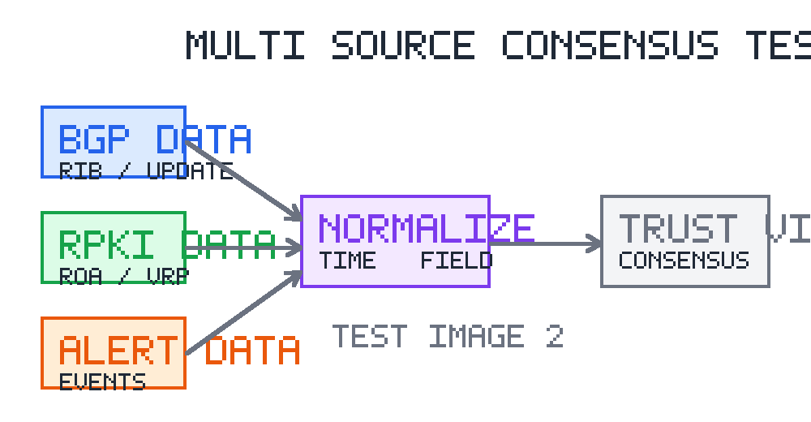

项目研究报告

# 一、研究背景与问题提出

## 1.1 研究背景

随着网络基础设施、业务系统和安全监测平台持续融合，面向多源数据的一致性分析逐渐成为基础设施安全治理的重要支撑。研究工作需要在公开数据、运行日志、策略配置和告警事件之间建立统一关联，以提升异常识别和处置解释能力。

## 1.2 研究问题

本报告示例用于测试研究报告类文档的 Markdown 到 Word 生成能力，重点覆盖研究背景、研究目标、技术路线、实验设计、结果分析、图表和参考文献等结构要素。研究问题包括：多源数据如何进行统一建模，不同来源之间的冲突如何识别，以及结果如何形成可复核的证据链。

# 二、研究目标与技术路线

## 2.1 研究目标

本研究面向多源网络安全数据一致性验证场景，构建由数据采集、字段归一、时间对齐、冲突检测和可信视图生成组成的分析流程。目标是在保持数据可追溯性的前提下，提高跨源异常识别的稳定性和解释性。

## 2.2 技术路线

研究技术路线如图 2-2-1-1 所示。整体流程首先对多源数据进行接入与清洗，其次基于统一字段模型完成时间窗口对齐，再通过规则比对、阈值检测和权重投票生成一致性判断结果，最后输出可复核的证据链和分析结论。

图 2-2-1-1 多源数据一致性研究技术路线

# 三、研究方法与实验设计

## 3.1 数据来源

研究数据包括公开路由测量数据、资源授权数据、告警事件记录和人工策略配置。公开路由测量数据可来自 RouteViews、RIPE RIS 和 BGPStream 等平台，这些平台能够提供长期、可复现的 BGP 数据观测能力[1]。

## 3.2 指标设计

实验指标围绕完整性、时效性、一致性和可解释性展开，具体指标如表 3-2-1-1 所示。

表 3-2-1-1 研究评价指标

| 指标 | 含义 | 评价方式 |
| --- | --- | --- |
| 完整性 | 数据字段和证据链是否充分 | 字段覆盖率、缺失率 |
| 时效性 | 多源数据是否处于同一时间窗口 | 时间偏移、延迟分布 |
| 一致性 | 不同来源结论是否冲突 | 冲突率、一致率 |
| 可解释性 | 判断结果是否可追溯 | 证据链数量、人工复核通过率 |

## 3.3 实验流程

1）数据预处理。对不同来源的数据进行字段清洗和格式统一，形成可比较的标准记录。

2）时间窗口对齐。根据数据采集频率和业务场景设置时间窗口，降低传播延迟对一致性判断的影响。

3）冲突检测与解释。对不一致结果保留原始证据、规则命中情况和人工复核记录，以支持后续分析。

# 四、研究结果与分析

## 4.1 结果概述

初步实验表明，多源数据一致性验证能够降低单一数据源异常对整体判断的影响。对于短时间内出现的数据差异，引入时间窗口和证据链管理后，可以减少将正常传播延迟误判为异常的情况。

## 4.2 问题分析

当前方法仍然受到观测点分布、数据源延迟、策略配置缺失和人工标注质量的影响。后续研究需要进一步引入更细粒度的可信度建模方法，并结合长期历史数据评估模型稳定性。

# 五、结论与展望

本报告示例表明，研究报告类文档可以通过统一 Markdown 结构组织背景、目标、方法、实验和结论，并通过图表和参考文献支撑论证。该类型文档适合使用当前 skill 进行 Word 格式生成，但在正式使用时仍需根据具体研究对象补充完整数据、实验结果和引用来源。

参考文献

[1] Orsini C, King A, Giordano D, et al. BGPStream: a software framework for live and historical BGP data analysis[C]//Proc. of IMC. ACM, 2016: 429-444.
