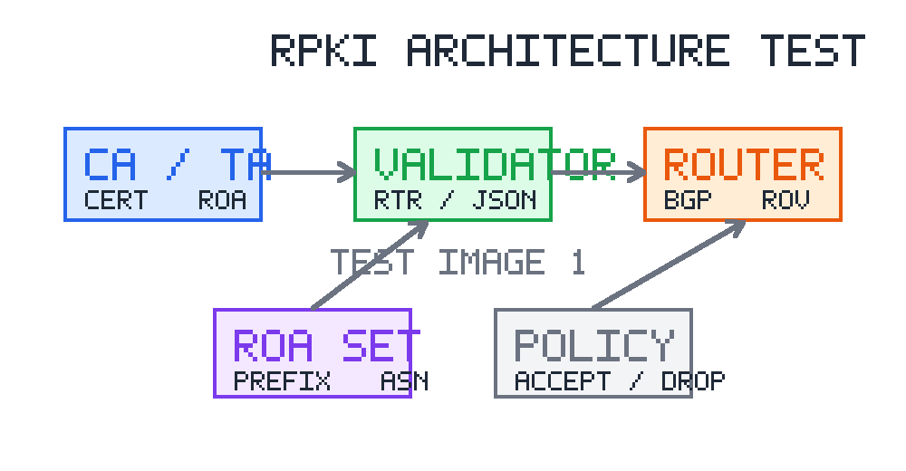

项目调研报告扩展示例

# 一、调研背景与目标

## 1.1 调研背景

网络基础设施安全治理需要同时关注路由安全、域名安全、云边协同和监测告警等多个方向。随着数据来源不断增多，单一平台或单一指标已经难以支撑完整判断，因此需要对代表性技术、平台能力和落地限制进行系统调研。

## 1.2 调研目标

本调研报告示例用于测试调研类文档在当前 skill 中的适配情况，重点覆盖调研背景、调研范围、方法、对象对比、问题归纳和建议等内容结构，并验证图题、表题、参考文献和三线表的输出效果。

# 二、调研范围与方法

## 2.1 调研范围

本次调研围绕路由安全数据采集、资源公钥基础设施、BGP 历史数据分析和开源工具链展开，重点关注 RouteViews、RIPE RIS、BGPStream、Routinator 和 FRRouting 等对象。

## 2.2 调研方法

调研方法包括公开文献梳理、工具文档阅读、平台能力对比和典型场景归纳。对于公开数据平台，重点关注数据类型、访问方式、时间覆盖范围和适用场景；对于开源工具，重点关注部署方式、接口能力和与现有系统集成的可行性。

# 三、重点对象调研

## 3.1 RPKI 与路由起源验证

RPKI 通过资源证书和路由源授权记录对前缀宣告关系进行验证，为路由起源安全提供基础支撑。ROA 记录前缀、最大长度和授权自治系统号，验证器则根据这些信息生成 Valid、Invalid 或 NotFound 等判断结果[1]。

RPKI 体系结构如图 3-1-1-1 所示。

图 3-1-1-1 RPKI体系结构示意图

## 3.2 BGP 数据平台

RouteViews 和 RIPE RIS 长期采集全球多个观测点的 BGP RIB 与 UPDATE 数据，BGPStream 则提供统一的数据访问和处理框架，有助于开展历史分析、事件回放和实验复现[2]。

典型数据平台对比如表 3-2-1-1 所示。

表 3-2-1-1 典型BGP数据平台对比

| 平台 | 数据类型 | 主要用途 |
| --- | --- | --- |
| RouteViews | RIB、UPDATE | 全球路由历史分析 |
| RIPE RIS | RIB、UPDATE、实时流 | 多观测点路由监测 |
| BGPStream | 多源数据统一接口 | 实验复现和批处理分析 |

# 四、问题归纳与趋势判断

## 4.1 主要问题

当前相关技术在实际应用中仍面临数据源覆盖不均、时间同步困难、平台接口差异、策略信息缺失和异常解释不足等问题。对于跨区域和跨主体场景，仅依赖单一观测点或单一验证结果容易产生判断偏差。

## 4.2 发展趋势

后续发展趋势主要包括多源数据融合、证据链管理、自动化解释、实时监测和与运营策略的深度结合。通过将公开数据、验证结果和本地策略共同纳入分析流程，可以提升安全治理结果的可信度。

# 五、调研结论与建议

调研表明，公开路由测量平台和 RPKI 工具链已经具备较成熟的基础能力，但在多源一致性分析、异常解释和工程化集成方面仍有进一步提升空间。建议后续优先建设统一数据模型，完善历史数据回放能力，并建立面向实际运行场景的验证流程。

参考文献

[1] Lepinski M, Kent S. An Infrastructure to Support Secure Internet Routing[R]. RFC 6480, 2012.

[2] Orsini C, King A, Giordano D, et al. BGPStream: a software framework for live and historical BGP data analysis[C]//Proc. of IMC. ACM, 2016: 429-444.
